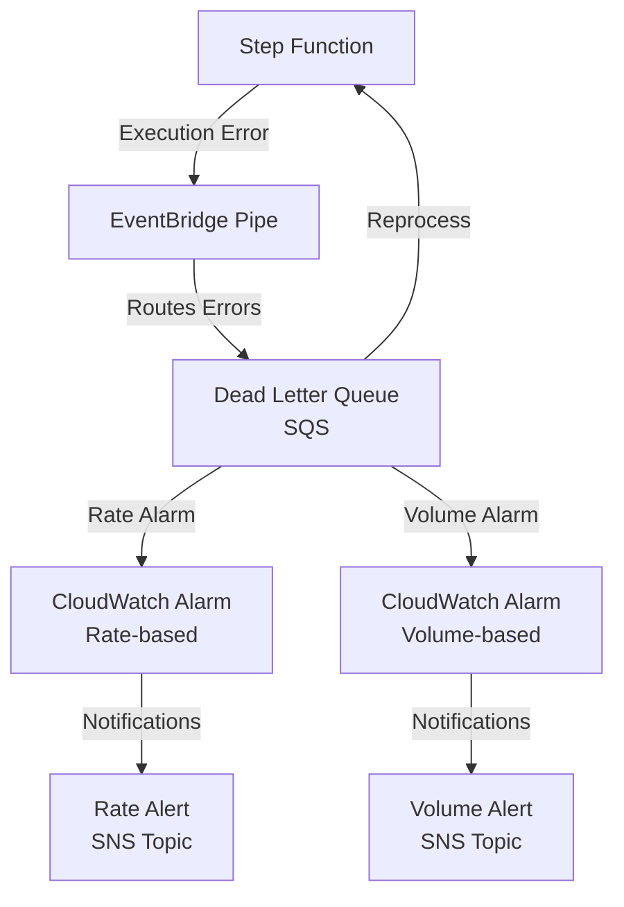

# Terraform AWS Step Function Error Notification

This module sets up an error handling and notification system for AWS Step Functions using EventBridge Pipes, SQS DLQ, CloudWatch Alarms, and SNS Topics.

## Architecture Diagram



## Components

- **Step Function**: The state machine being monitored for errors
- **EventBridge Pipe**: Captures and routes Step Function execution errors to DLQ
- **SQS Dead Letter Queue**:
  - Stores failed execution details
  - Used to retry failed Step Function executions
  - Monitored by CloudWatch Alarms
- **CloudWatch Alarms**:
  - Rate-based: Monitors error frequency
  - Volume-based: Monitors total error count
- **SNS Topics**:
  - Rate alerts: Notifications for error rate thresholds
  - Volume alerts: Notifications for error count thresholds

## Usage

```hcl
module "example_context" {
  source     = "registry.terraform.io/SevenPico/context/null"
  version    = "2.0.0"
  context    = module.context.self
  attributes = ["example", "sfn"]
}

module "step_function_error_notification" {
  source                = "../../"
  context               = module.example_context.self
  state_machine_arn     = aws_sfn_state_machine.example.arn
  eventbridge_pipe_name = "error-handler-pipe"
  sqs_queue_name        = "error-dlq"
}
```

## License

This project is licensed under the MIT License.
